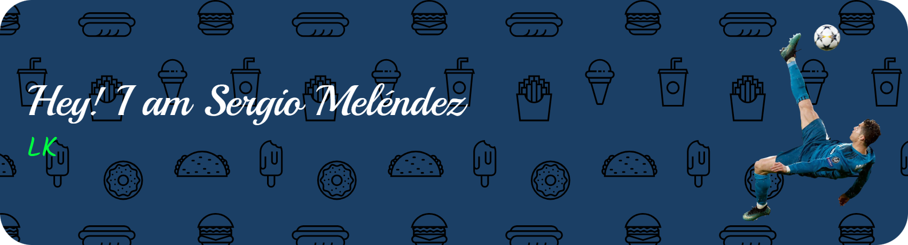
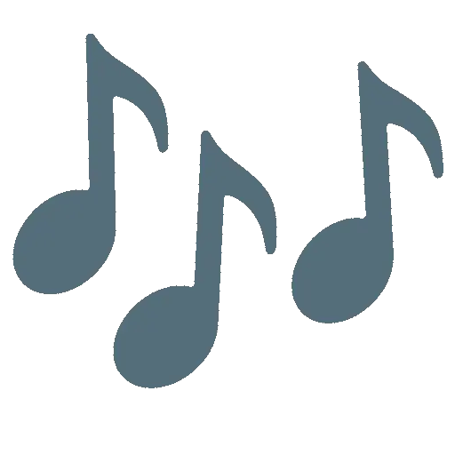

<!-- ================================= -->
<!--        1. Banner Section          -->
<!-- ================================= -->
<!--
This banner was created with:
https://leviarista.github.io/github-profile-header-generator/
https://www.kindpng.com/
-->

  

---
<!-- ================================= -->
<!--   Stats & Development Tools 🛠️    -->
<!-- ================================= -->
<!-- https://googlefonts.github.io/noto-emoji-animation/ -->
<h2 align="center">
  
  Stats & Development Tools
  
</h2>

<!-- ================================= -->
<!--            2. Stats 📊            -->
<!-- ================================= -->
<!--
This Stats section was created with:
- https://gh-stats-gen.vercel.app/
- https://techstack-generator.vercel.app/
- https://skillicons.dev/
-->

<!-- Gif & GitHub Stats -->

  
  &nbsp;&nbsp;&nbsp;&nbsp;
  

<!-- ================================= -->
<!--    3. Technologies & Tools ⚙️     -->
<!-- ================================= -->

  <table align="center" width="80%" style="margin: auto; border-collapse: collapse;">
    <!-- Frameworks -->
    <tr>
      <td align="center" width="96"> React</td>
      <td align="center" width="96"> VSCode</td>
      <td align="center" width="96"> A. Studio</td>
      <td align="center" width="96"> Godot</td>
      <td align="center" width="96"> Vite</td>
      <td align="center" width="96"> Vercel</td>
    </tr>
    <!-- Languages -->
    <tr>
      <td align="center" width="96"> Python</td>
      <td align="center" width="96"> Kotlin</td>
      <td align="center" width="96"> JavaScript</td>
      <td align="center" width="96"> TypeScript</td>
      <td align="center" width="96"> C#</td>
      <td align="center" width="96"> Tailwind</td>
    </tr>
    <!-- Others -->
    <tr>
      <td align="center" width="96"> Figma</td>
      <td align="center" width="96"> MySQL</td>
      <td align="center" width="96"> Obsidian</td>
      <td align="center" width="96"> Npm</td>
      <td align="center" width="96"> Supabase</td>
      <td align="center" width="96"> Git</td>
    </tr>
  </table>

---
<!-- ================================= -->
<!--            4. Spotify 🎶          -->
<!-- ================================= -->
<h2 align="center">
  
  Spotify
  
</h2>

<!-- Spotify Section -->
<!-- https://spotify-github-profile.kittinanx.com/ -->

  
  

